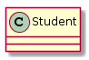
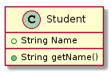
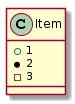
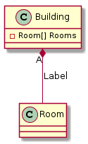
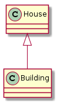
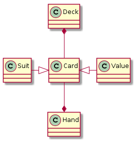
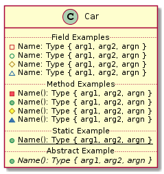
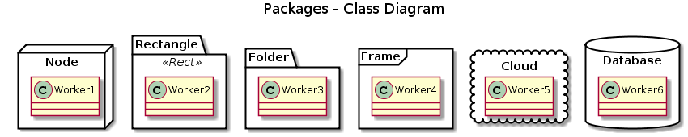

# Writing UML
This layout presumes enough knowledge of UML to understand the various diagram classes.

These instructions are primarily focused on the plantuml syntax for work with the [PlantText](www.plantext.com) editor.


## Simple Beginnings

It's best practice to open all files with an @startuml and @enduml diagram

```
@startuml
...
@enduml
```

Titles can be added to the diagram with a title statement

```
title UML Diagram
```


## Classes

A simple class is declared with the `class` keyword.

```
class Student
```




Classes can gain features by enclosing them in braces during declaration.

```
class Student {
  +String Name
  +String getName()
}
```



Different characters produce different bullet points.

```
class Item {
  + 1
  * 2
  - 3
}
```




Try to use bullet points of differnt styles and a logical ordering to display different class principles.


## Class Relationships

Classes can connect to each other through *Composition* and *Inheritance*

Both styles follw the same basic syntax:

```
<Target> <Arrow-label>[Arrow] <Origin>: <label>
```

#### Composition

Remember, composition implies that the inheritting clas __has a__ instance of the base class.

```
class Room
class Building{
  -Room[] Rooms
}

Building "A" *-- Room: Label  
```



#### Inheritance

Remember, inheritance means that the pointing class __is a__ instance of the pointed class, and add other features.

```
class Building
class House

House <|-- Building
```



Most UML parsers will have some rules to organize where images end up in an inheritence diagram, but orders can be specified in the arrows.

```
class Card
class Suit
class Value
class Deck
class Hand

Hand *-up- Card
Deck *-down- Card
Card <|-left- Suit
Card <|-right- Value
```




## Methods

For more accurate depictions of more complex items in a class (i.e. methods)

```
class Car {
  .. Field Examples ..
- Name: Type { arg1, arg2, argn }
+Name: Type { arg1, arg2, argn }
#Name: Type { arg1, arg2, argn }
~Name: Type { arg1, arg2, argn }

  .. Method Examples ..
-Name(): Type { arg1, arg2, argn }
+Name(): Type { arg1, arg2, argn }
#Name(): Type { arg1, arg2, argn }
~Name(): Type { arg1, arg2, argn }

  .. Static Example ..
+{static} Name(): Type { arg1, arg2, argn }

  .. Abstract Example ..
+{abstract} Name(): Type { arg1, arg2, argn }
}
```




## Packages

Packages are containers that group like classes together to show location in a system, a tech stack, or a network.

```
package Node <<Node>> {
  class Worker1
}

package Rectangle <<Rect>> {
  class Worker2
}

package Folder <<Folder>> {
  class Worker3
}

package Frame <<Frame>> {
  class Worker4
}

package Cloud <<Cloud>> {
  class Worker5
}

package Database <<Database>> {
  class Worker6
}
```


